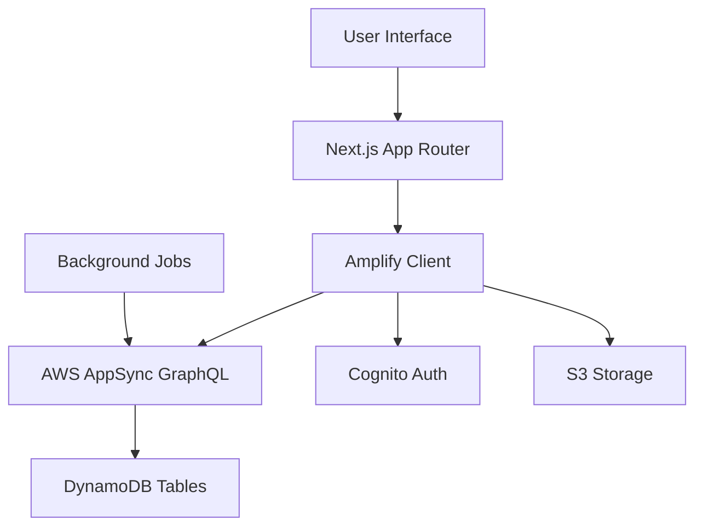

# Design Document

## Overview

The Citizen Supervision Platform is built as a modern web application using Next.js 15 with App Router, AWS Amplify Gen 2 for backend services, and a clean, responsive UI using Tailwind CSS and Radix UI components. The platform follows a modular architecture that supports multi-tenancy for different countries while maintaining a unified codebase.

## Architecture

### Frontend Architecture

- **Framework**: Next.js 15 with App Router for server-side rendering and optimal performance
- **UI Framework**: Radix UI components with Tailwind CSS for consistent, accessible design
- **State Management**: Zustand for global state management with React Context for localized state
- **Internationalization**: i18next with react-i18next for multi-language support
- **Authentication**: AWS Amplify Auth with email-based authentication

### Backend Architecture

- **Backend-as-a-Service**: AWS Amplify Gen 2 with GraphQL API
- **Database**: Amazon DynamoDB with GraphQL schema
- **Authentication**: Amazon Cognito User Pools
- **File Storage**: Amazon S3 for document and image storage
- **Real-time Updates**: AWS AppSync subscriptions for live data updates

### Data Flow



## Components and Interfaces

### Core Components

#### 1. Authentication System

- **LoginForm**: Email/password authentication with validation
- **RegisterForm**: User registration with email verification
- **AuthWrapper**: HOC for protecting authenticated routes
- **UserProfile**: Profile management and citizen points display

#### 2. Civil Servant Management

- **CivilServantSearch**: Advanced search with filters (name, position, department, location)
- **CivilServantProfile**: Comprehensive profile display with obligations and KPIs
- **CivilServantCard**: Summary card for search results and lists
- **SupervisionList**: User's supervised civil servants dashboard

#### 3. Obligation Tracking

- **ObligationForm**: Create/edit obligations with rich text editor
- **ObligationCard**: Display obligation with progress indicators
- **ObligationTimeline**: Chronological view of obligation updates
- **ObligationFilters**: Filter by status, category, deadline, etc.

#### 4. KPI Management

- **KPIForm**: Create measurable KPIs with targets and deadlines
- **KPIChart**: Visual representation using Recharts
- **KPIDashboard**: Overview of all KPIs with progress indicators
- **KPIComparison**: Compare performance across time periods

#### 5. Punch Card System

- **PunchCardCalendar**: Monthly calendar view of attendance
- **AttendanceChart**: Daily/weekly attendance patterns
- **AttendanceStats**: Summary statistics and anomaly detection
- **AttendanceExport**: Export attendance data

#### 6. Citizen Points & Rewards

- **PointsDisplay**: Current balance and earning history
- **RewardsCatalog**: Available rewards with point costs
- **RedemptionForm**: Reward redemption interface
- **PointsHistory**: Detailed transaction history

#### 7. Dashboard & Analytics

- **MainDashboard**: Overview of all supervision activities
- **PerformanceCharts**: Visual analytics using Recharts
- **ReportGenerator**: Custom report creation and export
- **NotificationCenter**: System notifications and alerts

### Interface Specifications

#### GraphQL Schema Extensions

```graphql
type CivilServant @model {
  id: ID!
  name: String!
  position: String!
  department: String!
  location: String
  profileImage: String
  contactInfo: AWSJSON
  obligations: [Obligation] @hasMany
  kpis: [KPI] @hasMany
  punchCardData: [PunchCard] @hasMany
  supervisors: [Supervision] @hasMany
  createdAt: AWSDateTime!
  updatedAt: AWSDateTime!
}

type Obligation @model {
  id: ID!
  title: String!
  description: String!
  category: ObligationCategory!
  status: ObligationStatus!
  deadline: AWSDate
  evidence: [String]
  civilServantId: ID! @index
  civilServant: CivilServant @belongsTo
  updates: [ObligationUpdate] @hasMany
  createdBy: ID!
  createdAt: AWSDateTime!
  updatedAt: AWSDateTime!
}

type KPI @model {
  id: ID!
  title: String!
  description: String
  target: Float!
  current: Float!
  unit: String!
  deadline: AWSDate!
  civilServantId: ID! @index
  civilServant: CivilServant @belongsTo
  updates: [KPIUpdate] @hasMany
  createdBy: ID!
  createdAt: AWSDateTime!
  updatedAt: AWSDateTime!
}

type PunchCard @model {
  id: ID!
  date: AWSDate!
  checkIn: AWSTime
  checkOut: AWSTime
  status: AttendanceStatus!
  notes: String
  civilServantId: ID! @index
  civilServant: CivilServant @belongsTo
  createdAt: AWSDateTime!
  updatedAt: AWSDateTime!
}

type CitizenPoints @model {
  id: ID!
  userId: ID! @index
  balance: Int!
  totalEarned: Int!
  totalSpent: Int!
  transactions: [PointTransaction] @hasMany
  createdAt: AWSDateTime!
  updatedAt: AWSDateTime!
}

type Reward @model {
  id: ID!
  title: String!
  description: String!
  pointCost: Int!
  category: RewardCategory!
  isActive: Boolean!
  stock: Int
  image: String
  createdAt: AWSDateTime!
  updatedAt: AWSDateTime!
}

enum ObligationCategory {
  CAMPAIGN_PROMISE
  WORK_OBLIGATION
  PUBLIC_COMMITMENT
}

enum ObligationStatus {
  PENDING
  IN_PROGRESS
  COMPLETED
  OVERDUE
  CANCELLED
}

enum AttendanceStatus {
  PRESENT
  ABSENT
  LATE
  EARLY_LEAVE
  HOLIDAY
}

enum RewardCategory {
  DIGITAL_BADGE
  NFT_MEDAL
  PHYSICAL_ITEM
  EXPERIENCE
}
```

## Data Models

### User Management

- **User**: Extended Cognito user with citizen points and preferences
- **UserPreferences**: Language, notification settings, dashboard layout
- **UserActivity**: Tracking engagement for point calculation

### Supervision System

- **Supervision**: Many-to-many relationship between users and civil servants
- **SupervisionSettings**: User-specific settings for each supervised civil servant
- **SupervisionStats**: Aggregated statistics for performance tracking

### Notification System

- **Notification**: System notifications for deadlines, updates, achievements
- **NotificationPreferences**: User preferences for notification types and delivery
- **NotificationTemplate**: Reusable templates for different notification types

### Analytics & Reporting

- **PerformanceMetric**: Calculated metrics for civil servants and overall system
- **Report**: Generated reports with filters and export options
- **AuditLog**: System audit trail for administrative actions

## Error Handling

### Client-Side Error Handling

- **ErrorBoundary**: React error boundaries for graceful failure handling
- **Toast Notifications**: User-friendly error messages using Sonner
- **Form Validation**: Real-time validation with React Hook Form and Zod
- **Network Error Recovery**: Automatic retry logic for failed requests

### Server-Side Error Handling

- **GraphQL Error Handling**: Structured error responses with error codes
- **Authentication Errors**: Proper handling of auth failures and token expiration
- **Data Validation**: Server-side validation using Amplify schema validation
- **Rate Limiting**: Protection against abuse with proper error responses

### Error Monitoring

- **Error Logging**: Comprehensive logging for debugging and monitoring
- **Error Reporting**: Integration with monitoring services for production issues
- **User Feedback**: Error reporting mechanism for users to report issues

## Testing Strategy

### Unit Testing

- **Component Testing**: React Testing Library for component behavior
- **Hook Testing**: Custom hooks testing with React Hooks Testing Library
- **Utility Testing**: Pure function testing with Jest
- **Schema Testing**: GraphQL schema validation testing

### Integration Testing

- **API Testing**: End-to-end API testing with mock data
- **Authentication Flow**: Complete auth flow testing
- **Data Flow Testing**: Testing data mutations and subscriptions
- **Multi-language Testing**: i18n functionality testing

### End-to-End Testing

- **User Journey Testing**: Critical user paths automation
- **Cross-browser Testing**: Compatibility across major browsers
- **Mobile Responsiveness**: Testing on various device sizes
- **Performance Testing**: Load testing and performance benchmarks

### Testing Infrastructure

- **Test Data Management**: Seeded test data for consistent testing
- **Mock Services**: Mocked AWS services for local development
- **CI/CD Integration**: Automated testing in deployment pipeline
- **Test Coverage**: Minimum 80% code coverage requirement

## Security Considerations

### Authentication & Authorization

- **Multi-factor Authentication**: Optional MFA for enhanced security
- **Role-based Access Control**: Different permission levels (citizen, admin, super-admin)
- **Session Management**: Secure session handling with automatic expiration
- **Password Security**: Strong password requirements and secure storage

### Data Protection

- **Data Encryption**: Encryption at rest and in transit
- **PII Protection**: Careful handling of personally identifiable information
- **Data Retention**: Configurable data retention policies
- **GDPR Compliance**: Data protection regulation compliance

### API Security

- **Rate Limiting**: Protection against API abuse
- **Input Validation**: Comprehensive input sanitization
- **SQL Injection Prevention**: Parameterized queries and ORM usage
- **CORS Configuration**: Proper cross-origin resource sharing setup

## Performance Optimization

### Frontend Performance

- **Code Splitting**: Dynamic imports for optimal bundle sizes
- **Image Optimization**: Next.js Image component with lazy loading
- **Caching Strategy**: Aggressive caching for static content
- **Bundle Analysis**: Regular bundle size monitoring and optimization

### Backend Performance

- **Database Optimization**: Efficient queries and proper indexing
- **Caching Layer**: Redis caching for frequently accessed data
- **CDN Integration**: CloudFront for global content delivery
- **Auto-scaling**: Automatic resource scaling based on demand

### Monitoring & Analytics

- **Performance Monitoring**: Real-time performance tracking
- **User Analytics**: User behavior tracking for UX improvements
- **Error Tracking**: Comprehensive error monitoring and alerting
- **Resource Monitoring**: AWS resource utilization tracking
